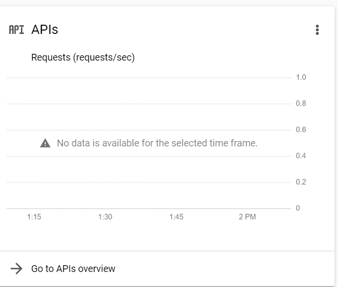

# Using the Google OAuth Module with Google Cloud

## Determine Which APIs and Scopes Your App Needs

Third-party apps that interact with Google Cloud must enable the specific *Service APIs* they want to use and request OAuth permission for specific application *scopes*. The first step in enabling a Service API and requesting a scope is determining which ones you need.

Google's API documentation comes in two parts: "Guides" and "Reference." I have found the Guides to be largely useless, but the Reference is pretty good. Search for: Google Cloud API Reference thingYouWantToUse, and you'll likely end up at the right place.

For example, the Google Photos reference is at [https://developers.google.com/photos/library/reference/rest](https://developers.google.com/photos/library/reference/rest).

### Find the Service API name and Endpoint

The first page of the reference will tell you the name of the Service API and its endpoint URL. You will eventually need both pieces of information:


Make a note of both:

```
 Service: photoslibrary.googleapis.com
 Endpoint: https://photoslibrary.googleapis.com
```

### Find Required API Scopes

Every method of an API can, potentially, require a different permission scope. In practice, though, there is usually some higher-order scope that can be requested to get access to everything in an API.  

 > A word of caution: general purpose scopes tend to be restricted. Using a restricted scope requires app-level review by Google before users will be allowed to consent to your OAuth requests. It is best practice to choose the most restrictive scopes that will work for your project.

To find the proper scopes, click into the API Methods that you want to use. For instance, let's say that your application wants to use the [`albums/get` method](https://developers.google.com/photos/library/reference/rest/v1/albums/get) to retrieve an album by ID. By reviewing that method's documentation, you can find the required scope:


The scopes are generally listed from most restricted (that is, most powerful but may require special permissions) to least restricted.

Make a note of the scope you want to use:
```
Scope: https://www.googleapis.com/auth/photoslibrary.readonly
```

Repeat this process for any additional methods your app wants to use. With some luck, there will be a lot of overlap in scopes.

## Configure the Google Cloud Application Console

Interacting with Google Cloud for authentication and to use APIs requires an application ID/secret token. You must create a Google Cloud Application to get these. Then you will associated your app with the Service APIs and OAuth Scopes that you noted in the previous section.

### Create a New Application

- Start at https://console.cloud.google.com/

- Accept ToS

- At top of page, "Select a Project" -> "New Project"


- Name your new project. In this tutorial, we will use "My App" as the project name.

- The project will be created asynchronously. You may have to "select" it after it is complete. When everything is correct, the top of the console will look like this:


### Enable Service APIs

- In the center of the Console, you will see a tile labeled "APIs." At the bottom of that tile, click "Go to APIs overview."



- On the "APIs and Services" screen, click "+ ENABLE APIS AND SERVICES."


- Input the "Service" name you identified earlier (in our example, `photoslibrary.googleapis.com`) into the search box:


- You should get exactly one result. Click it:


- Hit the shiny blue "ENABLE" button.


- Repeat this process for any additional Service APIs you want to use in your project.

### Create Credentials

- To make a Google Cloud API call in your application, you need app credentials. To create them, return to the "APIs and Services" screen and then click "Credentials" in the menu on the left:


#### Generate an API Key

- At the top of the Credentials screen, click "+ CREATE CREDENTIALS" and then select "API Key."


This will create an API key for your app. Make a note of it:

```
API Key: SECRET_STUFF
```

#### Configure OAuth Consent Screen

- You also need to configure an OAuth Consent Screen. Do this by clicking "+ CREATE CREDENTIALS" again, this time selecting "OAuth client ID".

- You must configure your consent screen to proceed. Do so by pressing the "CONFIGURE CONSENT SCREEN" button.

This will guide you through an OAuth Consent Screen wizard. Each page has some choices you should make:

##### User info
 - User Type: External

##### Application info
 - App name: Whatever You Would Like
 - User support email: Your email
 - App domain: **Leave blank**
 - Authorized domains: **Leave blank**
 - Developer contact information, Email addresses: Your email

##### Scopes
 - Click the "ADD OR REMOVE SCOPES" button. 
 
 - In the "filter" field, paste (one at a time) the OAuth scopes you identified earlier in the tutorial and then hit enter. 

 - Tick the checkbox next to the scope you are looking for:

 

 - Then click the blue "UPDATE" button.

This will populate your list of requested OAuth scopes:


 - Hit "SAVE AND CONTINUE" to continue.

##### Test Users

Google allows a small number of test users to use your app before you publish it. Add Google accounts that you want to be able to test your app here (including your own). Then hit "SAVE AND CONTINUE" to continue.

These test users will be allowed to use the OAuth consent screen to agree to any scopes your app requests -- even sensitive and restricted scopes. When the app is published, sensitive and restricted scopes require further review of your app before users can consent to them.

#### Create an OAuth 2.0 Client ID

 - Return to the Credentials console page and again click "+ CREATE CREDENTIALS"

 - Select "OAuth client ID"

 - For "Application Type" select "TVs and Limited Input devices."

 - Give your client a unique name.

 - Hit the blue "Create" button.

This will display two pieces of information you need to record:

```
Your Client ID: <Unique to each project>
Your Client Secret: <Secret>
```

## Use the Google OAuth Module

The OAuth flow supported by the example Google OAuth module in the Moddable SDK is the "Limited Input Device." In this configuration flow, the following steps are performed:

1. The device contacts the Google OAuth server to request an OAuth token with permissions to use a specific set of OAuth scopes.
2. The server returns a URL and a string of characters.
3. The URL and string must both be displayed to the user on the device. The user will then go to the URL on a phone or computer and input the string into a textbox.
4. While this is happening, the OAuth module periodically queries the server to see if the process has been completed.
5. When the user has completed their task, an OAuth token will be returned to the module. That token must be used to authenticate Service API calls to use Google Cloud services.

In the `timecard` app's `google-sheets-mod`, OAuth credential management is provided by `oAuthManager.js`

### GoogleOAuth Class Description

`oAuthManager.js` exports a single default class, `GoogleOAuth`. 

```javascript
import GoogleOAuth from "oAuthManager";
```

**oAuthManager.js requires two small changes to use.**
The application Client ID and Client Secret are set in this file. They are implemented as constants, to facilitate setting them from the Moddable Store:

```javascript
const CLIENT_ID = "GOOGLE_CLIENT_ID";
const CLIENT_SECRET = "GOOGLE_CLIENT_SECRET";
```
(The committed app uses a pair of encrypt/decrypt functions provided by the `timecard` host to mildly obfuscate the `CLIENT_SECRET`. This is not necessary during development.)

While developing, you should replace those strings with your actual Client ID and Client Secret, as noted above. (Directly or via a manifest config, etc.)

#### Constructing a `GoogleOAuth` Instance

The `GoogleOAuth` constructor takes a single options object argument. The constructor expects the following properties on that object (all required):

| Property | Description |
| :---: | :--- |
| `scope` | A String specifying the OAuth scopes for which the app is requesting a token. Multiple scopes may be comma-separated in a list (no spaces). 
| `onOAuthCode` | Callback that will be called when initial contact has been made with the OAuth server and the URL and String to be displayed to the user are available. It will be called with a single argument, an options object with properties `verification_url` (the URL to display), `user_code` (the string to be displayed), and `expires_in` (number of seconds until the OAuth process will timeout).
| `onOAuthSuccess` | Callback that will be called when the user has successfully completed the OAuth flow in a browser.
| `onOAuthFailure` | Callback that will be invoked if the user cancels or otherwise fails in completing the OAuth flow in the browser. (**Not yet implemented; not yet required.**)

See `googleMod.js` in the `store-content` repository for a worked example of using the `GoogleOAuth` module for authentication. This module should be reusable; just remove Google Sheets / Google Drive references and replace them with your own Service API. 

```javascript
this.oauthManager = new GoogleOAuth({
    scope: "https://www.googleapis.com/auth/drive.file",
    onOAuthCode: oauthData => {
        this.oauthData = oauthData;
        application.distribute("onGoogleOAuthCode", oauthData);
    },
    onOAuthSuccess: () => {
        this.ready = true;
        this.sheet.find();
        application.distribute("onGoogleOAuthSuccess");
    },
    onOAuthFailure: () => {
        this.ready = false;
        application.distribute("onGoogleOAuthFailure");
    }
});
```

#### `GoogleOAuth` Instance Properties

The `GoogleOAuth` instance constructed above has two useful properties:

| Property | Description |
| :---: | :--- |
| `authorized` | Boolean indicating if the instance has successfully authenticated and received an OAuth token. 
| `token` | OAuth token to be used in API calls.


#### Using the OAuth Token in Requests

The OAuth token secured in the authorization process is used as part of building subsequent requests to Google Cloud APIS. It is supplied as an `Authorization` header in the HTTP request. 

This example (from `googleSheets.js`) uses the token to build a request that creates a Google Sheets spreadsheet:

```javascript
let body = {
    "properties": {
        "title": TIMECARD_NAME,
    }
};

let request = new Request({
    host: "sheets.googleapis.com", path: `/v4/spreadsheets/`, response: String,
    method: "POST",
    headers: ["Content-Type", "application/json", "Authorization", this.oAuthManager.token],
    body: JSON.stringify(body),
    port: 443, Socket: SecureSocket
});
```

To use a similar approach with a different API, replace the `host` with the "Endpoint" noted above (minus the `https://`), the `path` with the path specified in the API reference for the specific API call you want to make. The requirements for the body of the request vary between API calls. 
